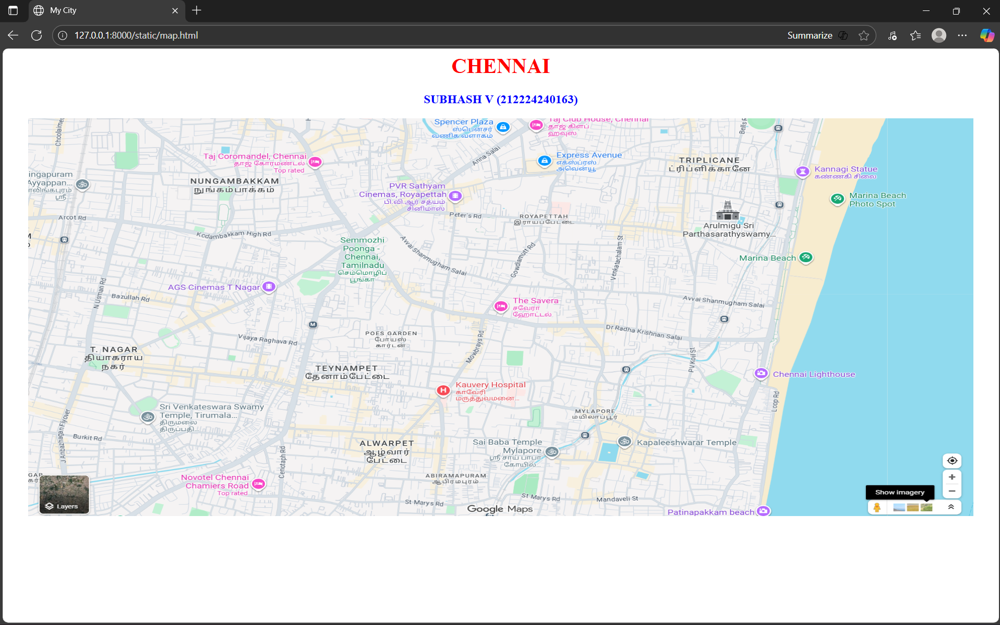
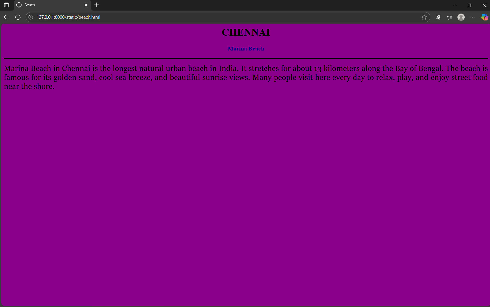
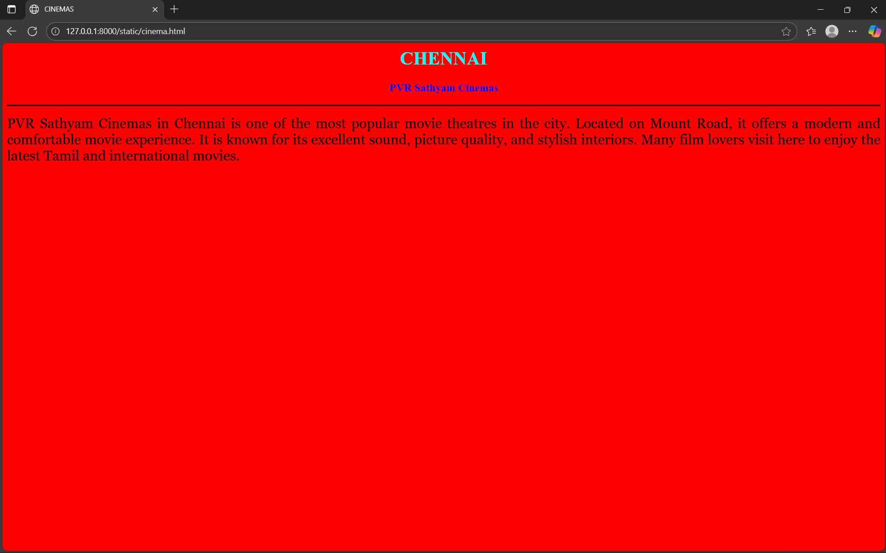
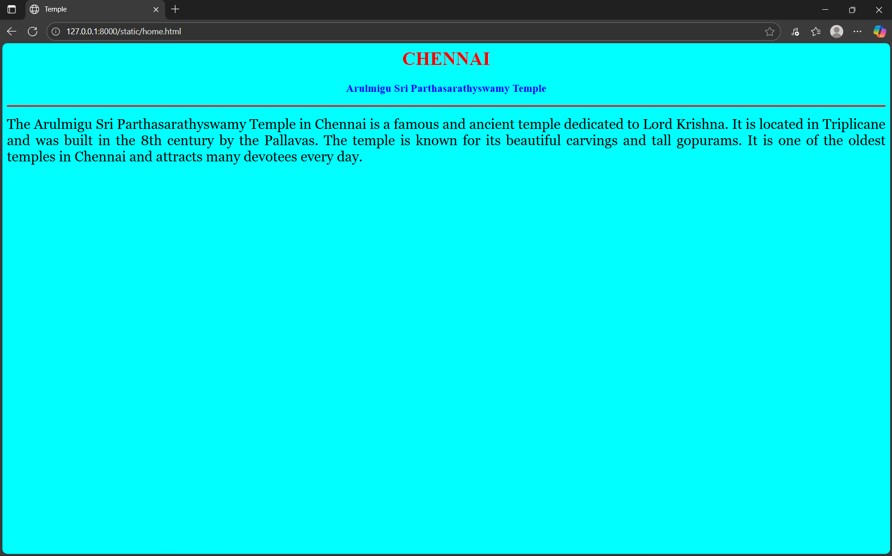
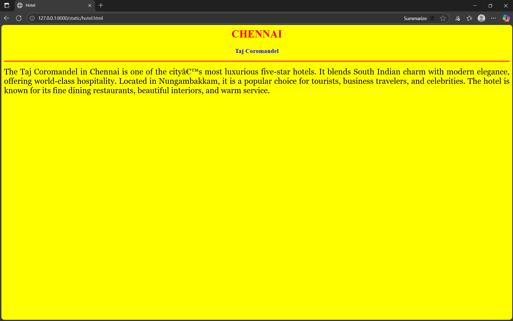

# Ex04 Places Around Me
## Date: 

## AIM
To develop a website to display details about the places around my house.

## DESIGN STEPS

### STEP 1
Create a Django admin interface.

### STEP 2
Download your city map from Google.

### STEP 3
Using ```<map>``` tag name the map.

### STEP 4
Create clickable regions in the image using ```<area>``` tag.

### STEP 5
Write HTML programs for all the regions identified.

### STEP 6
Execute the programs and publish them.

## CODE
```
Map

<html>
<head>
<title>My City</title>
</head>
<body>
<h1 align="center">
<font color="red"><b>CHENNAI</b></font>
</h1>
<h3 align="center">
<font color="blue"><b>SUBHASH V (212224240163)</b></font>
</h3>
<center>

<map name="MyCity">
<area shape="rect" coords="80,80,300,300" href="home.html" title="Arulmigu Sri Parthasarathyswamy Temple">
<area shape="circle" coords="570, 230,45" href="hotel.html" title="Taj Coromandel">
<area shape="circle" coords="640, 400,100" href="cinema.html" title="PVR Sathyam Cinemas">
<area shape="circle" coords="1120, 360, 250" href="beach.html" title="Marina Beach">
<area shape="rect" coords="950, 120, 1100, 150" href="temple.html" title="Kapaleeshwarar Temple">
</map>
</center>
</body>
</html>

Beach 

<html>
<head>
<title>Beach</title>
</head>
<body bgcolor="darkmagenta">
<h1 align="center">
<font color="black"><b>CHENNAI</b></font>
</h1>
<h3 align="center">
<font color="darkblue"><b>Marina Beach</b></font>
</h3>
<hr size="3" color="black">
<p align="justify">
<font face="Georgia" size="5">
Marina Beach in Chennai is the longest natural urban beach in India. It stretches for about 13 kilometers along the Bay of Bengal. 
The beach is famous for its golden sand, cool sea breeze, and beautiful sunrise views. 
Many people visit here every day to relax, play, and enjoy street food near the shore.
</p>
</body>
</html>

cinema

<html>
<head>
<title>CINEMAS</title>
</head>
<body bgcolor="red">
<h1 align="center">
<font color="cyan"><b>CHENNAI</b></font>
</h1>
<h3 align="center">
<font color="blue"><b>PVR Sathyam Cinemas</b></font>
</h3>
<hr size="3" color="black">
<p align="justify">
<font face="Georgia" size="5">
PVR Sathyam Cinemas in Chennai is one of the most popular movie theatres in the city. 
Located on Mount Road, it offers a modern and comfortable movie experience. 
It is known for its excellent sound, picture quality, and stylish interiors. 
Many film lovers visit here to enjoy the latest Tamil and international movies.
</p>
</body>
</html>

Home

<html>
<head>
<title>Temple</title>
</head>
<body bgcolor="cyan">
<h1 align="center">
<font color="red"><b>CHENNAI</b></font>
</h1>
<h3 align="center">
<font color="blue"><b>Arulmigu Sri Parthasarathyswamy Temple</b></font>
</h3>
<hr size="3" color="red">
<p align="justify">
<font face="Georgia" size="5">
The Arulmigu Sri Parthasarathyswamy Temple in Chennai is a famous and ancient temple dedicated to Lord Krishna. 
It is located in Triplicane and was built in the 8th century by the Pallavas. The temple is known for its beautiful carvings and tall gopurams. 
It is one of the oldest temples in Chennai and attracts many devotees every day.
</p>
</body>
</html>

Hotel

<html>
<head>
<title>Hotel</title>
</head>
<body bgcolor="yellow">
<h1 align="center">
<font color="red"><b>CHENNAI</b></font>
</h1>
<h3 align="center">
<font color="blue"><b>Taj Coromandel</b></font>
</h3>
<hr size="3" color="red">
<p align="justify">
<font face="Georgia" size="5">
The Taj Coromandel in Chennai is one of the city’s most luxurious five-star hotels. It blends South Indian charm with modern elegance, offering world-class hospitality. 
Located in Nungambakkam, it is a popular choice for tourists, business travelers, and celebrities. 
The hotel is known for its fine dining restaurants, beautiful interiors, and warm service.
</p>
</body>
</html>

Temple

<html>
<head>
<title>Temple</title>
</head>
<body bgcolor="cyan">
<h1 align="center">
<font color="red"><b>CHENNAI</b></font>
</h1>
<h3 align="center">
<font color="blue"><b>Kapaleeshwarar Temple</b></font>
</h3>
<hr size="3" color="red">
<p align="justify">
<font face="Georgia" size="5">
The Kapaleeshwarar Temple in Chennai is a beautiful ancient temple dedicated to Lord Shiva, located in Mylapore. It is famous for its tall and colorful gopuram (tower) built in Dravidian style.
The temple’s architecture, sculptures, and rituals reflect Tamil culture and devotion. Many festivals, especially the Arubathimoovar festival, attract thousands of devotees every year.
</p>
</body>
</html>
```

## OUTPUT








## RESULT
The program for implementing image maps using HTML is executed successfully.
